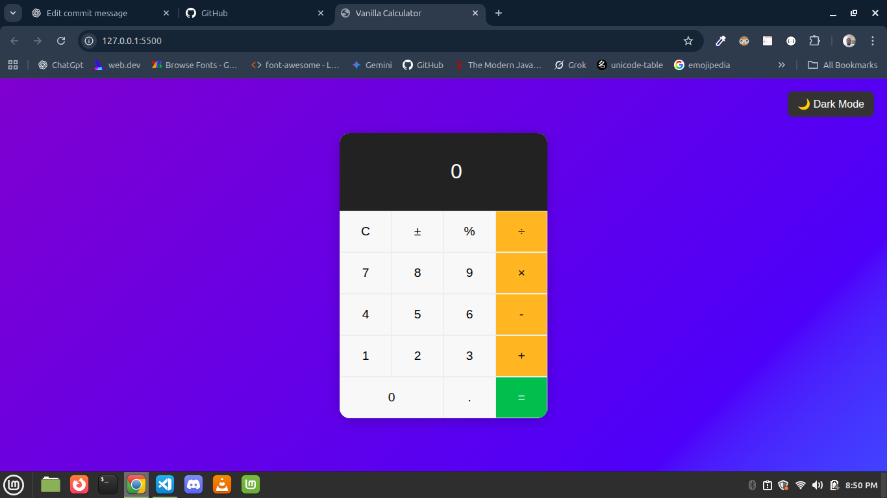
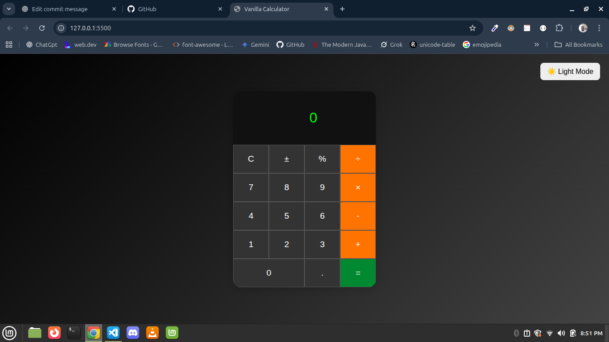

# Calculator

A simple calculator built with pure HTML, CSS, and JavaScript.
Now supports **Dark Mode toggle**  

## 🌟 Features

- Basic arithmetic operations
- Percentage and sign toggle
- Dark Mode / Light Mode (with saved preference)
- Responsive design

---

## Dark Mode Preview

### Light Mode



### Dark Mode



## How to Run

## 🚀 How to Run

1. Clone the repo:

   ```bash
   git clone https://github.com/Goody24/Calculator.git


2. Open index.html in your browser.
